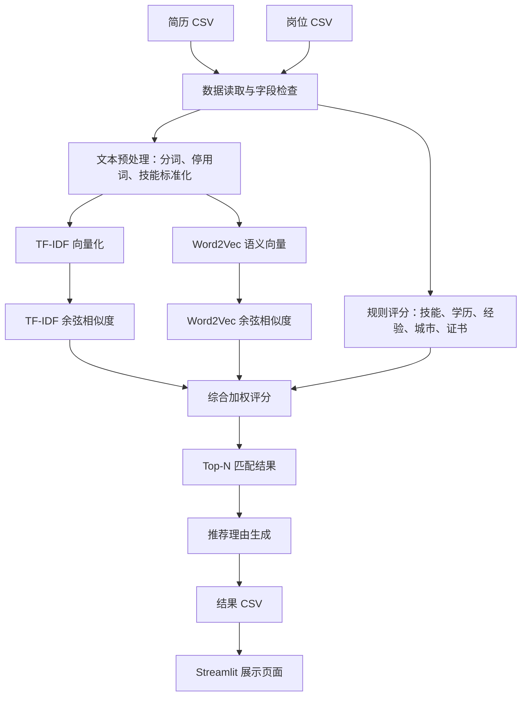
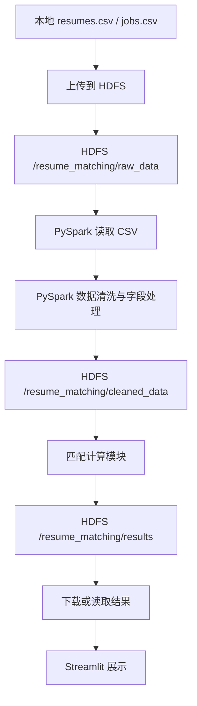

# 学生项目任务书：基于大数据+AI的简历-岗位人才匹配系统

## 一、项目名称

基于大数据+AI的简历-岗位人才匹配系统

## 二、项目背景

在真实招聘场景中，企业经常会面对大量简历和岗位需求。人工筛选简历存在以下问题：

- 简历数量多，人工查看效率低；
- 不同招聘人员判断标准不完全一致；
- 简历和岗位信息都是文本，人工提取关键信息比较费时；
- 学生或求职者也希望知道自己更适合哪些岗位，以及还缺少哪些能力。

本项目要求你们使用 Python、文本处理算法、Streamlit、HDFS 和 PySpark，开发一个可以运行、可以展示、可以解释的人岗匹配系统。

系统最终要能回答三个问题：

1. 某个学生适合哪些岗位？
2. 某个岗位适合哪些学生？
3. 为什么系统认为他们匹配？

这不是一个只输出分数的小脚本，而是一个完整的软件系统。

---

## 三、项目总体目标

你们需要完成一个“简历-岗位智能匹配系统”，系统应具备以下能力：

1. 能读取简历数据和岗位数据。
2. 能对简历文本和岗位文本进行清洗、分词、停用词过滤和技能词标准化。
3. 能使用 TF-IDF、Word2Vec 和余弦相似度计算简历与岗位的文本相似度。
4. 能加入技能、学历、经验、城市、证书等多维评分。
5. 能计算综合匹配分，并输出 Top-N 推荐结果。
6. 能为每条匹配结果生成推荐理由。
7. 能使用 Streamlit 做一个可交互展示页面。
8. 能将原始数据上传到 HDFS。
9. 能使用 PySpark 完成至少一次数据读取、清洗、转换或结果输出。
10. 能完成项目报告、运行说明和答辩展示。

一句话概括：

> 你们要做一个可以把“简历”和“岗位”自动匹配起来，并能解释匹配原因的软件系统。

---

## 四、最终系统应该是什么样

系统完成后，建议至少包含两个使用视角。

### 1. 从学生视角查看岗位推荐

用户在页面左侧选择某个学生简历，右侧实时显示：

- 推荐岗位 Top-N；
- 每个岗位的综合匹配分；
- 技能匹配分；
- 文本相似度分；
- 学历匹配分；
- 经验匹配分；
- 推荐理由；
- 缺少技能或提升建议。

示例：

```text
学生：张同学

推荐岗位 1：数据分析实习生
综合匹配分：86.5
推荐理由：技能匹配较高，共同技能包括 Python、SQL、数据分析；学历满足岗位要求；城市匹配；建议补充 Excel 技能。

推荐岗位 2：大数据开发实习生
综合匹配分：78.2
推荐理由：简历中包含 Python、Spark、SQL，与岗位方向较接近；但 Hadoop 相关技能不足。
```

### 2. 从岗位视角查看候选人推荐

用户选择某个岗位，系统显示：

- 推荐候选人 Top-N；
- 每位候选人的综合匹配分；
- 候选人具备的核心技能；
- 候选人缺少的岗位技能；
- 推荐或不推荐的原因。

示例：

```text
岗位：大数据开发实习生

推荐候选人 1：王同学
综合匹配分：82.0
推荐理由：具备 Python、Spark、SQL 技能，文本相似度较高；缺少 Hadoop 项目经验。
```

---

## 五、系统总体架构

本项目建议按照“本地版先跑通，大数据版再迁移”的方式完成。

### 1. 本地版架构

本地版主要使用 Python、pandas、jieba、scikit-learn 和 Streamlit。



### 2. 大数据版架构

大数据版需要把原始数据上传到 HDFS，并使用 PySpark 完成数据读取、清洗、转换或结果输出。



### 3. 推荐的工程目录结构（仅供参考）

建议你们的项目目录如下：

```text
resume_matching_project/
├── data/
│   ├── resumes.csv
│   ├── jobs.csv
│   ├── stopwords.txt
│   └── skill_alias.json
├── output/
│   ├── top_matches.csv
│   └── explainable_match_result.csv
├── src/
│   ├── preprocess.py
│   ├── similarity.py
│   ├── scoring.py
│   ├── matcher.py
│   ├── hdfs_utils.py
│   └── spark_job.py
├── app.py
├── requirements.txt
└── README.md
```

各文件建议职责如下：

| 文件              | 作用                              |
| --------------- | ------------------------------- |
| `preprocess.py` | 文本清洗、jieba 分词、停用词过滤、技能词标准化      |
| `similarity.py` | TF-IDF、Word2Vec、余弦相似度计算         |
| `scoring.py`    | 技能分、学历分、经验分、城市分、综合分、推荐理由        |
| `matcher.py`    | 调用各模块完成批量匹配和 Top-N 排序           |
| `hdfs_utils.py` | 使用 Python 调用 HDFS 命令，上传、查看、删除文件 |
| `spark_job.py`  | 使用 PySpark 读取 HDFS 数据、清洗数据、写回结果 |
| `app.py`        | Streamlit 展示页面                  |
| `README.md`     | 项目运行说明                          |

---

## 六、数据需求

### 1. 简历数据（仅供参考） `resumes.csv`

建议至少包含 10 至 30 条简历数据。字段设计如下：

| 字段名                  | 含义   | 示例                    |
| -------------------- | ---- | --------------------- |
| `resume_id`          | 简历编号 | R001                  |
| `name`               | 学生姓名 | 张同学                   |
| `education`          | 学历   | 本科                    |
| `major`              | 专业   | 数据科学与大数据技术            |
| `skills`             | 技能列表 | Python;SQL;Spark;数据分析 |
| `experience_years`   | 经验年限 | 0                     |
| `city`               | 期望城市 | 南昌                    |
| `expected_salary`    | 期望薪资 | 5000                  |
| `certificates`       | 证书   | 英语四级;计算机二级            |
| `project_experience` | 项目经历 | 做过数据分析课程项目            |
| `self_description`   | 自我描述 | 熟悉 Python 和数据清洗       |

### 2. 岗位数据（仅供参考） `jobs.csv`

建议至少包含 8 至 20 条岗位数据。字段设计如下：

| 字段名                      | 含义     | 示例                    |
| ------------------------ | ------ | --------------------- |
| `job_id`                 | 岗位编号   | J001                  |
| `job_title`              | 岗位名称   | 数据分析实习生               |
| `company`                | 企业名称   | 某科技公司                 |
| `required_education`     | 最低学历要求 | 本科                    |
| `required_skills`        | 岗位技能要求 | Python;SQL;数据分析;Excel |
| `min_experience_years`   | 最低经验年限 | 0                     |
| `city`                   | 工作城市   | 南昌                    |
| `salary`                 | 岗位薪资   | 6000                  |
| `preferred_certificates` | 加分证书   | 英语四级                  |
| `job_description`        | 岗位描述   | 负责数据清洗、统计分析和报表制作      |

### 3. 停用词表（仅供参考） `stopwords.txt`

停用词表用于过滤对匹配帮助不大的词，例如：

```text
的
了
和
以及
本人
熟悉
负责
相关
一定
较强
```

### 4. 技能词标准化表 （仅供参考）`skill_alias.json`

用于把不同写法统一成标准技能词。

示例：

```json
{
  "py": "python",
  "Python语言": "python",
  "pyspark": "spark",
  "SparkSQL": "spark",
  "结构化查询语言": "sql",
  "数据可视化": "可视化"
}
```

---

## 七、核心功能需求

### 1. 数据读取与字段检查

系统应能读取 `resumes.csv` 和 `jobs.csv`。

需要检查：

- 文件是否存在；
- 必要字段是否完整；
- 是否有空值；
- 技能字段是否能正常拆分；
- 文本字段是否能拼接成完整匹配文本。

最低要求：

```text
能够成功读取简历和岗位 CSV，并打印数据行数、字段名和前几行数据。
```

### 2. 文本预处理

系统应对简历文本和岗位文本进行处理。

至少包括：

- 拼接多个文本字段；
- jieba 分词；
- 停用词过滤；
- 技能词标准化；
- 输出清洗后的分词文本。

示例：

```text
原始文本：本人熟悉 Python、SQL，做过数据分析项目。
处理后：python sql 数据分析 项目
```

### 3. 文本相似度计算

系统应使用 TF-IDF、Word2Vec 和余弦相似度计算简历与岗位的文本相似度。

要求：

- 能为每份简历计算所有岗位的相似度；
- 能为每个岗位计算所有候选人的相似度；
- 相似度建议转换为 0 到 100 分。
- 至少输出 `tfidf_score` 和 `word2vec_score` 两类文本相似度分数，或在报告中说明二者的对比结果。

推荐实现方式：

```text
TfidfVectorizer
        ↓
cosine_similarity
        ↓
tfidf_score

Word2Vec
        ↓
平均词向量生成文本向量
        ↓
cosine_similarity
        ↓
word2vec_score

tfidf_score 和 word2vec_score 加权
        ↓
semantic_score
```

说明：

- TF-IDF 更关注词面重合和词语重要性；
- Word2Vec 更关注词语在上下文中的语义接近程度；
- 小数据集训练 Word2Vec 效果可能不稳定，本项目重点是理解词向量思想和实现流程。

### 4. 多维评分（仅供参考）

系统不能只看文本相似度，还需要加入规则分。

至少实现以下四类评分：

| 评分项           | 说明                           |
| ------------- | ---------------------------- |
| 技能匹配分         | 简历技能和岗位技能的交集比例               |
| TF-IDF 相似度分   | TF-IDF + 余弦相似度得到的词面相似度       |
| Word2Vec 相似度分 | Word2Vec 词向量 + 余弦相似度得到的语义相似度 |
| 综合语义分         | 将 TF-IDF 分和 Word2Vec 分按权重合成  |
| 学历匹配分         | 学生学历是否满足岗位最低学历要求             |
| 经验匹配分         | 学生经验年限是否满足岗位要求               |

推荐扩展：

| 评分项   | 说明            |
| ----- | ------------- |
| 城市匹配分 | 期望城市和岗位城市是否一致 |
| 薪资匹配分 | 岗位薪资是否达到学生期望  |
| 证书匹配分 | 学生证书是否满足岗位偏好  |

### 5. 综合匹配分（仅供参考）

系统应使用权重合成总分。

基础公式建议：

```text
综合匹配分 = 技能分 × 0.35 + TF-IDF分 × 0.20 + Word2Vec分 × 0.15 + 学历分 × 0.15 + 经验分 × 0.15
```

如果加入城市、薪资、证书，可以调整为：

```text
综合匹配分 = 技能分 × 0.30 + TF-IDF分 × 0.20 + Word2Vec分 × 0.15 + 学历分 × 0.15 + 经验分 × 0.10 + 城市分 × 0.05 + 证书分 × 0.05
```

注意：

- 权重总和应为 1；
- 每个维度的分数建议保持在 0 到 100；
- 需要能说明为什么这样设置权重。

### 6. Top-N 推荐

系统应支持：

1. 给某个学生推荐最匹配的前 N 个岗位；
2. 给某个岗位推荐最匹配的前 N 个候选人。

输出结果至少包含（仅供参考）：

| 字段                 | 含义              |
| ------------------ | --------------- |
| `resume_id`        | 简历编号            |
| `name`             | 学生姓名            |
| `job_id`           | 岗位编号            |
| `job_title`        | 岗位名称            |
| `total_score`      | 综合匹配分           |
| `tfidf_score`      | TF-IDF 文本相似度分   |
| `word2vec_score`   | Word2Vec 语义相似度分 |
| `semantic_score`   | 综合文本语义分         |
| `skill_score`      | 技能匹配分           |
| `education_score`  | 学历匹配分           |
| `experience_score` | 经验匹配分           |
| `matched_skills`   | 共同技能            |
| `missing_skills`   | 缺少技能            |
| `reason`           | 推荐理由            |

### 7. 推荐理由生成

系统必须为每条匹配结果生成可读的推荐理由。

示例：

```text
技能匹配较高，共同技能包括 Python、SQL、数据分析；学历满足岗位要求；经验略低于岗位要求；缺少 Excel 技能，建议补充相关工具练习。
```

推荐理由应至少包含：

- 共同技能；
- 缺少技能；
- 学历是否满足；
- 经验是否满足；
- 文本相似度高、中、低；
- 可选的提升建议。

### 8. Streamlit 展示页面

系统应提供一个可运行的 Streamlit 页面。

最低要求：

- 页面标题；
- 左侧选择学生；
- 右侧显示该学生推荐岗位 Top-N；
- 显示综合分和各维度分；
- 显示推荐理由；
- 支持下载匹配结果 CSV。

推荐扩展：

- 增加岗位视角；
- 增加分数柱状图；
- 增加缺少技能提示；
- 增加筛选城市、岗位类型、最低分数；
- 增加上传 CSV 功能。

### 9. HDFS 数据管理

最终项目必须使用 HDFS 管理原始数据或结果数据。

建议 HDFS 目录如下：

```text
/resume_matching/
├── raw_data/
│   ├── resumes.csv
│   └── jobs.csv
├── cleaned_data/
│   ├── cleaned_resumes.csv
│   └── cleaned_jobs.csv
└── results/
    └── top_matches.csv
```

至少需要完成：

```bash
hdfs dfs -mkdir -p /resume_matching/raw_data
hdfs dfs -mkdir -p /resume_matching/cleaned_data
hdfs dfs -mkdir -p /resume_matching/results
hdfs dfs -put data/resumes.csv /resume_matching/raw_data/
hdfs dfs -put data/jobs.csv /resume_matching/raw_data/
hdfs dfs -ls /resume_matching/raw_data
```

### 10. PySpark 处理

最终项目至少要使用 PySpark 完成一次数据处理。

最低要求：

- 使用 PySpark 从 HDFS 读取 `resumes.csv` 或 `jobs.csv`；
- 完成字段选择、空值处理、去重或新增列；
- 将处理结果写回 HDFS。

推荐扩展：

- 使用 PySpark 批量处理简历和岗位数据；
- 使用 Spark MLlib 的 `Tokenizer`、`HashingTF`、`IDF` 复现 TF-IDF；
- 使用 Spark MLlib 的 `Word2Vec` 复现词向量和文本语义相似度；
- 使用 PySpark 完成部分多维评分；
- 将最终匹配结果写入 HDFS。

---

## 八、推荐实现路线

### 第一步：先完成本地最小闭环

先不要急着上 HDFS 和 PySpark。

你们需要先让本地版跑通：

```text
读取 CSV
    ↓
清洗文本
    ↓
计算 TF-IDF 相似度和 Word2Vec 相似度
    ↓
计算多维评分
    ↓
输出匹配结果 CSV
    ↓
Streamlit 展示
```

本地版验收标准：

- 能运行 `matcher.py`；
- 能生成 `output/top_matches.csv`；
- 能运行 `streamlit run app.py`；
- 页面能选择学生并显示推荐岗位。

### 第二步：再迁移到 HDFS

完成本地版之后，再将数据放到 HDFS。

你们需要做到：

- 创建 HDFS 项目目录；
- 上传原始数据；
- 能在 9870 页面看到上传结果；
- 能用命令行查看 HDFS 文件。

### 第三步：使用 PySpark 替换部分 pandas 处理

不要一开始就把所有代码都改成 PySpark。

建议先迁移这些部分：

- CSV 读取；
- 字段检查；
- 空值填充；
- 去重；
- 新增拼接字段；
- 清洗结果写回 HDFS。

### 第四步：完善展示和答辩材料

最后需要整理：

- Streamlit 页面；
- 项目运行说明；
- 项目报告；
- 答辩 PPT；
- 关键截图；
- 小组分工。

---

## 九、技术栈要求

| 类别         | 技术                                       |
| ---------- | ---------------------------------------- |
| 操作系统       | Ubuntu 24 虚拟机                            |
| 虚拟化平台      | VMware                                   |
| Java 环境    | Oracle JDK 8u202                         |
| 大数据组件      | Hadoop 3.3.6、HDFS、YARN                   |
| 计算框架       | Spark 3.5.1、PySpark 3.5.1                |
| Python 环境  | `~/ai_env` 虚拟环境                          |
| Python 基础库 | os、csv、json、subprocess                   |
| 数据处理       | pandas、PySpark DataFrame                 |
| 中文文本处理     | jieba                                    |
| 文本相似度      | scikit-learn、TF-IDF、Word2Vec、余弦相似度       |
| 词向量实现      | gensim Word2Vec 或 Spark MLlib Word2Vec   |
| 可视化展示      | Streamlit                                |
| 开发工具       | PyCharm                                  |
| 数据格式       | CSV、TXT、JSON                             |
| 项目验证       | BigDataController.py、HDFS 9870、YARN 8088 |

---

## 十、项目最低完成要求

如果时间紧张，至少必须完成以下内容：

1. 环境搭建完成，并通过 `BigDataController.py` 验证。
2. 有 `resumes.csv` 和 `jobs.csv` 两份样例数据。
3. 能完成文本预处理：分词、停用词过滤、技能词标准化。
4. 能计算 TF-IDF 相似度和 Word2Vec 相似度，并能说明二者区别。
5. 能计算技能分、学历分、经验分和综合分。
6. 能输出 Top-N 匹配结果 CSV。
7. 能生成推荐理由。
8. 有 Streamlit 展示页面。
9. 原始数据上传到 HDFS。
10. 至少有一个 PySpark 脚本能读取 HDFS 数据并写回 HDFS。
11. 能尝试使用 Spark MLlib 的 Word2Vec，或在报告中说明本地 Word2Vec 如何迁移到 PySpark。
12. 有 README 运行说明。
13. 能进行现场运行或演示。

---

## 十一、项目加分方向

在完成最低要求后，可以选择 1 至 3 个方向扩展。

| 加分方向  | 说明                                  |
| ----- | ----------------------------------- |
| 数据增强  | 增加更多简历和岗位样例，数据字段更丰富                 |
| 算法增强  | 加入城市分、薪资分、证书分、缺少技能建议                |
| 语义增强  | 调整 TF-IDF 与 Word2Vec 权重，对比不同语义分方案   |
| 大数据增强 | 使用 Spark MLlib 复现 TF-IDF 和 Word2Vec |
| 页面增强  | 支持岗位视角、分数图表、筛选条件、CSV 上传             |
| 解释增强  | 推荐理由更具体，能指出优势和短板                    |
| 工程增强  | 代码分层清晰，README 完整，异常处理完善             |
| 答辩增强  | 有流程图、架构图、结果截图、问题复盘                  |

不建议做的方向：

- 完全脱离“简历岗位匹配”主题；
- 只做页面，不做算法；
- 只做算法，不做展示；
- 只做本地 Python，不使用 HDFS 或 PySpark；
- 大量复制示例代码，没有自己的数据和改造。

---

## 十二、交付物要求

每组最终需要提交以下材料。

### 1. 项目源代码

应包含：

- 数据处理代码；
- 文本匹配代码；
- 多维评分代码；
- HDFS 操作代码；
- PySpark 处理代码；
- Streamlit 页面代码。

### 2. 项目报告

参考学校模板

### 3. 答辩 PPT

建议包含：

- 项目背景；
- 系统架构图；
- 技术栈；
- 数据处理流程；
- 算法设计；
- 系统演示截图；
- HDFS 和 PySpark 使用说明；
- 小组分工；
- 总结与反思。

### 6. 关键截图

至少包含：

- `jps` 进程截图；
- HDFS 9870 页面截图；
- YARN 8088 页面截图；
- HDFS 目录截图；
- PySpark 脚本运行截图；
- Streamlit 页面截图；
- 匹配结果截图。

---

## 十三、验收标准

| 评价项        | 要求                                 |
| ---------- | ---------------------------------- |
| 环境可用       | Hadoop、Spark、PySpark、PyCharm 能正常使用 |
| 数据完整       | 简历和岗位数据字段清晰，样例数量合理                 |
| 本地版功能      | 能完成读取、清洗、匹配、评分、导出                  |
| 算法正确       | TF-IDF、Word2Vec、余弦相似度、多维评分逻辑合理     |
| 结果可解释      | 能说明共同技能、缺少技能、推荐原因                  |
| 页面展示       | Streamlit 页面能运行，能交互查看结果            |
| HDFS 使用    | 原始数据或结果数据上传到 HDFS                  |
| PySpark 使用 | 至少完成一次 HDFS 数据读取、清洗或写回             |
| 工程结构       | 代码分层清楚，文件命名规范                      |
| 文档答辩       | README、报告、PPT 完整，能现场讲清楚            |

---

## 十四、小组分工建议

每组建议 3 至4人，可以参考以下角色分工。

| 角色      | 主要任务                                   |
| ------- | -------------------------------------- |
| 环境负责人   | 负责 Ubuntu、Hadoop、Spark、PyCharm、HDFS 验证 |
| 数据负责人   | 负责简历和岗位数据设计、清洗、字段检查                    |
| 算法负责人   | 负责分词、TF-IDF、Word2Vec、余弦相似度、多维评分        |
| 大数据负责人  | 负责 HDFS 目录、PySpark 脚本、结果写回             |
| 可视化负责人  | 负责 Streamlit 页面和交互展示                   |
| 文档答辩负责人 | 负责 README、项目报告、PPT 和答辩组织               |

人数较少的小组可以一人承担多个角色。

---

## 十五、答辩时需要讲清楚的问题

答辩时，每组至少要能回答：

1. 你们的系统解决了什么问题？
2. 简历数据和岗位数据有哪些字段？
3. 你们如何进行中文分词和技能词标准化？
4. TF-IDF、Word2Vec 和余弦相似度在项目中起什么作用？
5. 综合匹配分是怎么计算的？
6. 权重为什么这样设计？
7. 推荐理由是怎么生成的？
8. 本地版和大数据版有什么区别？
9. HDFS 在项目中存了什么数据？
10. PySpark 在项目中完成了什么任务？
11. Streamlit 页面有哪些功能？
12. 项目还有哪些不足，后续可以如何改进？

---

## 十六、注意事项

1. 先完成最小闭环，再做扩展功能。
2. 不要一开始就追求复杂页面，算法和数据链路更重要。
3. 每完成一个阶段都要保存代码和截图。
4. HDFS、YARN、Spark 出问题时，先检查 `jps` 和 Web 页面。
5. 所有成员都要理解项目主流程，不能只会自己负责的一小段。
6. 推荐理由要能解释，不要只输出“系统认为匹配”。
7. 项目最终必须能现场运行，不能只展示静态截图。

---

## 十七、项目完成后的效果

完成本项目后，你们应该能独立说明并演示：

```text
原始简历和岗位数据
        ↓
文本清洗与分词
        ↓
TF-IDF 和余弦相似度
        ↓
Word2Vec 语义向量
        ↓
技能、学历、经验等多维评分
        ↓
综合匹配分和推荐理由
        ↓
Top-N 推荐结果
        ↓
Streamlit 页面展示
        ↓
HDFS + PySpark 大数据版迁移
```

这就是本次实训项目的完整目标：

> 用大数据技术管理数据，用 AI 文本算法计算匹配，用可解释规则说明原因，用可视化页面展示结果。
